# 【20260330】宁波磁声科技NPI阶段数字化应用解决方案_v2.0_2603

- Source: `【20260330】宁波磁声科技NPI阶段数字化应用解决方案_v2.0_2603.pptx`
- Total slides: 29

## Slide 1

宁波磁声科技NPI阶段数字化应用解决方案

2026/03/30

## Slide 2

目录

01

业务现状分析

02

项目目标

03

项目解决方案

04

项目实施方法

05

下一步重点工作

## Slide 3

一、业务现状分析

## Slide 4

1、业务现状分析

磁声业务现状

01

产品结构

02

生产工艺

03

公司核心业务

产品线聚焦、产品类别精简，以标准磁体与定制电磁件为主，整体的加工工序不复杂。但因服务于Apple高端终端，对材料性能、几何公差及表面质量要求极为严苛。

公司主营高性能永磁材料（如钕铁硼）及微型电磁执行器（如控制磁阀、线性马达组件），产品主要应用于消费电子领域，其中A客户是公司最大的客户，销售占比超50%以上。

整体产线自动化程度比较高，大部分生产加工过程已不需要人工参与；AOI（自动光学检测）系统在多个工站得到广泛应用，覆盖外观缺陷、尺寸轮廓及磁极方向识别等场景。

IT系统现状

05

公司组织及人员

06

新产品研发（NPI）

04

组织架构扁平，无专职管理人员，员工直接参与一线业务；现场操作人员整体年轻、学习能力强，但春节前后约30%返乡，易出现短期“用工荒”，对项目高时效交付构成潜在风险。

新产品研发主要以A客户NPI节奏为牵引，覆盖 EVT、DVT到PVT等全阶段，工程团队和质量部门为核心成员。在NPI的各阶段，均会根据客户要求开展DFM、Q-Plan和MTD等策划分析。

目前公司部署的系统有：ERP、MES （鼎捷）和QMS系统。QMS系统应用情况不是理想，后续规划主要用于客户审核。汽车产品部署了PLM系统，近期刚上线。

### Speaker Notes

4

## Slide 5

1、业务现状分析

当前NPI业务痛点

磁声公司的新产品研发紧密围绕 A用户的NPI流程展开，各阶段均需按客户要求交付标准化模板文档。当前NPI活动执行、相关NPI表单编制等工作主要依靠线下人工推进，缺乏有效的数字化工具支撑，NPI材料编制过程耗时费力。亟需引入 AI 辅助等智能化手段，减轻项目团队负担，提升 NPI表单编制效率。

项目进度通过表格管理，缺乏可视化协同

NPI各阶段文档输出量大且重复性强

客户图纸数据错误频繁

数据来源分散，人工汇总耗时费力

客户提供的2D图纸经常发生部件尺寸与3D图纸尺寸不符、或当前技术无法满足产品性能等问题，图纸评审环节对工程师项目经验依赖较高

NPI项目计划通过Excel手工维护，任务分配、节点跟踪及风险预警均依赖线下沟通与人工跟催，无法实时掌握各环节进展，项目管理难以直观评估项目健康度

CPK、CRR等多种报告所需的数据，多需手动导出、整理、核对后录入线下Excel表格，过程繁琐，容易造成数据错误

NPI各阶段，需频繁输出Q-Plan、DFM、QTD等相关交付物，报告多依赖项目组人员手动编写，人工编制报告耗时长

### Speaker Notes

5

## Slide 6

二、项目目标

## Slide 7

2、项目目标

以NPI流程为基准，搭建覆盖EVT、DVT至PVT全阶段的NPI研发协同平台，集成NPI任务分派、交付物提交、节点评审、进度反馈等核心功能。各业务部门在平台上并行作业、实时更新状态，打破信息孤岛，使项目计划、风险预警与资源调配可视化，提升跨部门协同效率、及PM对项目的进度管控。

- 打造NPI研发协同平台，
- 实现NPI活动线上管控

通过本次项目搭建，系统化识别并梳理NPI过程中积累的工程经验、DFM规则、典型问题库、历史批准文档及关键参数等，构建研发&生产&工艺标准、企业知识库等结构化数据库，实现NPI从“个人经验”到“组织资产”的转化。同时为新人赋能、项目复用和持续改进提供可靠数据基础。

- 磁声NPI阶段
- 数字化应用

- 搭建AI智能体
- 高效辅助输出NPI交付物

- 沉淀经验与数据，
- 构建企业知识资产

聚焦高频、高重复、强结构化的文档编制场景（如Q-Plan填写、FAI报告生成等），部署AI智能工具链，自动完成图纸信息提取、数据填充、格式校验与交付物初稿生成。将工程师从繁琐的手工操作中解放，转而专注于技术判断与审核决策，整体文档编制效率提升30%+，同时保障输出质量与合规性。

## Slide 8

三、项目解决方案

## Slide 9

3、项目解决方案

方案总体思路

基于磁声的NPI业务流程，构建数字化NPI研发协同平台，实现业务、数据与决策的全面协同，并在平台中内嵌AI智能体，识别并落地NPI关键场景的智能化应用，助力NPI流程提效、减少人工编制NPI表单的负担。

NPI流程

数据

工艺

图纸

质量

Q-Plan

- 核
- 心
- 业
- 务

“1”个平台

- “n”个
- AI应用场景

DFM

MTD

检测方案

生产执行

物料准备

人员规划

磁声数字化研发协同平台

AI智能体

业务协同

数据协同

决策协同

FAI/SPC报告

工艺流程图

…

检验计划

DR

### Speaker Notes

9

## Slide 10

3、项目解决方案

数字化研发协同平台：NPI业务流程梳理

基于前期业务交流调研，目前整理宁波磁声NPI中开展的核心业务活动总览图如下所示：

角色

NPI阶段

DR

Proto（P1-P2）/EVT/DVT/PVT

RAMP

PM

项目管理

图纸接收

DFM策划

工程

自动化DFM策划

图纸评审

工艺流程设计

生产夹具设计

工艺流程设计

生产验证及优化

手工样件生产跟线

打样结果确认及DFM优化

DOE验证

CAE仿真

生产夹具制造

工艺流程图

…

SOP

工艺流程图

生产

手工样件打样

良率报告

品质

Q-Plan

GRR验证

图纸评审

- 策划定检测项目
- 策划测量频次

GRR报告

IQC计划

机加工检测计划

表面处理检测计划

CRR验证

OQC计划

作业指导

组装检测计划

可靠性测试计划

CRR报告

计量

MTD

策划测量方案

MTD检测执行

策划测量方案

设计测量治具

CPK报告

FAI报告

策划测量SOP

### Speaker Notes

10

## Slide 11

3、项目解决方案

数字化研发协同平台：NPI业务流程梳理

各NPI活动输出的NPI表单如下图所示：

| 编号 | 优先级 | NPI表单 |
| --- | --- | --- |
| 1 | 中 | Drawing Review （DR） |
| 2 | 中 | BOM（Bill of Material) |
| 3 | 中 | Process Flowchart |
| 4 | 高 | Q-Plan |
| 5 | 中 | CRR/GRR Template （重复性/相关性报告模版） |
| 6 | 中 | CRR/GRR Report （重复性/相关性报告） |
| 7 | 中 | Yield Report（良率报告） |
| 8 | 高 | FAI CPK Template / Report |
| 9 | 高 | YGA (Yield Gap Analyze) |
| 10 | 中 | MIL (Major Issue List) |
| 11 | 中 | Project Updates (PM/MDE/QPM) |
| 12 | 中 | Simulation (MM/FD/PC/Decay) |
| 13 | 低 | 内部图纸 |
| 14 | 中 | Packaging / Label |
| 15 | 中 | DFM（单件/组件） |
| 16 | 中 | Station/Line Qual Plan & report（工位 & 产线 资格认证计划与认证报告） |
| 17 | 低 | CDML（组件数据管理清单） |
| 18 | 中 | 外观检查标准 |
| 19 | 中 | MTD (Measurement, Test Document) |
| 20 | 中 | SIP（检验作业指导书） |
| 21 | 低 | SOP（作业指导书） |
| 22 | 中 | Reliability Test Report (可靠性报告） |
| 23 | 中 | OQC报告（出货检验报告） |

②

⑬

⑪

③

①

⑫

⑭

⑯

⑳

㉑

㉓

⑮

⑦

④

㉒

①

⑥

⑤

⑰

⑱

⑲

⑧

⑨

⑩

### Speaker Notes

11

## Slide 12

3、项目解决方案

NPI表单生成逻辑展示:DR

角色

NPI研发协同平台

PM

DR

分配任务

创建项目

接收图纸（2D/3D）

审批

子任务结束

MTD

- 项目信息
- 产品信息
- 其他要求等

…

工程

图纸评审过程

收到代办任务

填写建议并上传图片

填写同类问题解决方案及照片（如需）

填写问题描述并上传图纸图片

打开任务

提交

品质

收到代办任务

- 基于填写的信息，系统生成报告首页
- 可下载报告

- 提供的信息：
- 图纸问题点
- 历史类似项目信息
- …

点击AI辅助

对比图纸尺寸和标准库中的尺寸

OCR识别图纸尺寸

AI给出评审建议

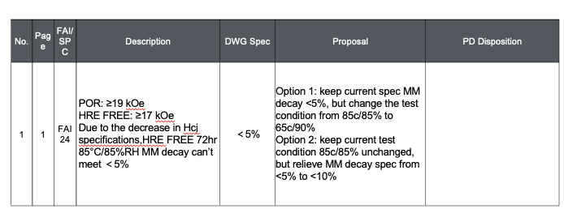

- 平台
- 能力
- &
- 数据库

历史图纸问题库

OCR图纸识别技术

零部件设计标准库

识别图纸中的尺寸，并与零部件标准库中的数据作对比

- 项目基础信息
- 问题类型、问题描述
- 最佳实践：照片
- …

### Speaker Notes

12

## Slide 13

3、项目解决方案

NPI表单生成逻辑展示:DR

实现逻辑概述：

- Step1：PM在NPI协同平台创建NPI项目，进行DR任务分配（其他NPI任务相同方式创建和派发）；
- Step2：负责人收到任务，在NPI协同平台提交任务。提交过程中可基于系统内嵌的AI智能体、数据库等能力，协助进行图纸评审；
- Step3：负责人提交评审意见后，PM对意见进行确认。可在NPI协同平台下载满足业务要求的DR报告；

实现路径：搭建NPI协同平台+OCR图纸识别技术+梳理业务数据（如：DR经验库、零部件标准库等）

实现程度预估：80-90%（AI辅助+人工判断，现阶段AI辅助约80%，后期AI模型训练后可继续提升）

业务收益：

- 效率提升：预估缩短DR报告编制周期30~40%，减少重复劳动；
- 质量保障：降低图纸评问题遗漏率，100%一次性识别图纸问题；同时，实现标准化问题解决方案的系统推荐；
- 知识沉淀：通过本项目，可助力磁声搭企业级DR经验库、零部件标准库等内部标准，形成可复用的组织资产；
- NPI活动在线监管和跟踪：实现NPI任务透明化管理，实现“事中实时监控、事后全程流痕”，任务逾期风险警告确保满足客户交付节点；

### Speaker Notes

13

## Slide 14

3、项目解决方案

数字化研发协同平台：功能架构

基于NPI业务流程，以“统一平台 + AI应用赋能”为核心理念，构建覆盖NPI全链路的研发协同平台，实现业务在线化与数据结构化；在此基础上，内嵌AI智能体，为关键场景提供智能化服务，驱动NPI提质增效。

用户

PC端

手机端

PAD端

工控机端

数据分析应用

管理看板

项目进度分析

关键节点预警

项目周期统计

数据报表

其他定制报表

业务管理

图纸评审

项目管理

DFM策划

Q-Plan管理

MTD检测执行

图纸上传

创建项目

工艺流程策划

检测计划制定

检测方案策划

图纸识别

任务分配

夹具设计

IQC计划

检测量具设计

创建评审任务

进度跟踪

创建打样任务

OQC计划

检测SOP管理

在线协同评审

里程碑设置

打样评审

测量方案策划

检测执行

可靠性测试计划

检测报告自动生成

问题跟踪管理

风险预警

GRR验证

图纸版本管理

项目进度查询

CRR验证

AI智能服务

DFM问题预测

智能图纸识别

SOP自动生成

检测项推荐

…

缺陷图片生成

用户管理

部门管理

角色管理

功能配置

属性字典

权限管理

配置管理

安全管理

资源管理

监控中心

基础数据模块

产品主数据

NPI项目库

图纸/BOM库

工艺知识库

检验标准库

DFM规则库

产品缺陷库

问题经验库

…

系统管理

外域系统集成

OA系统集成

企微/飞书集成

ERP集成

QMS集成

其他系统

## Slide 15

3、项目解决方案

NPI研发协同平台：平台功能展示

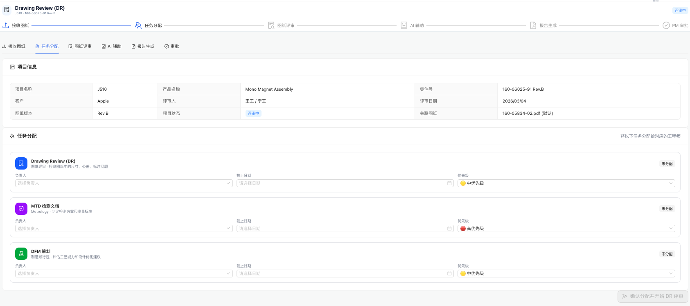

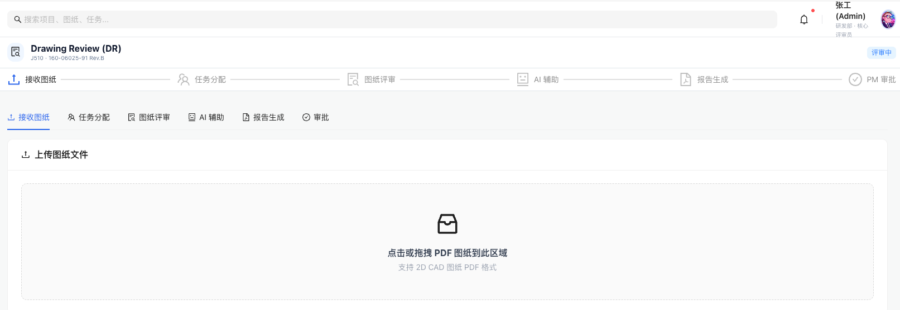

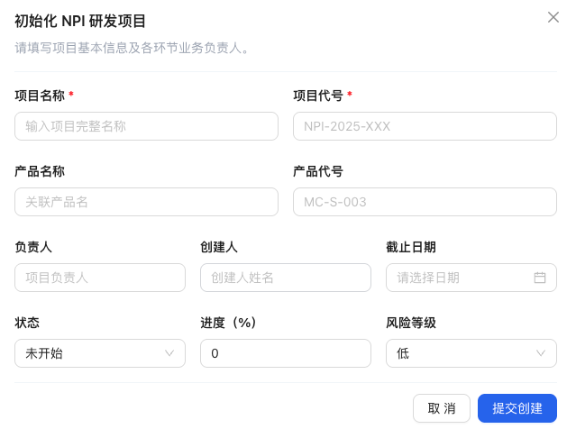

## Slide 16

3、项目解决方案

NPI研发协同平台：平台功能展示

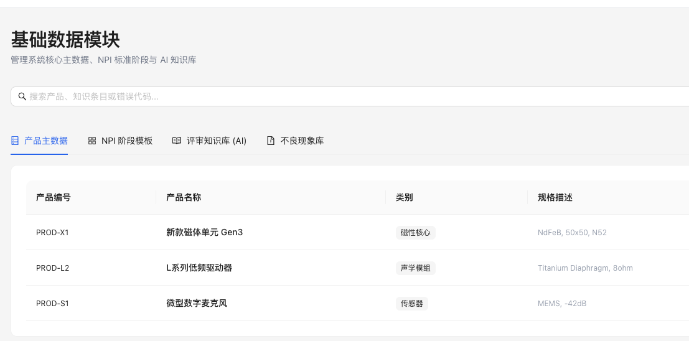

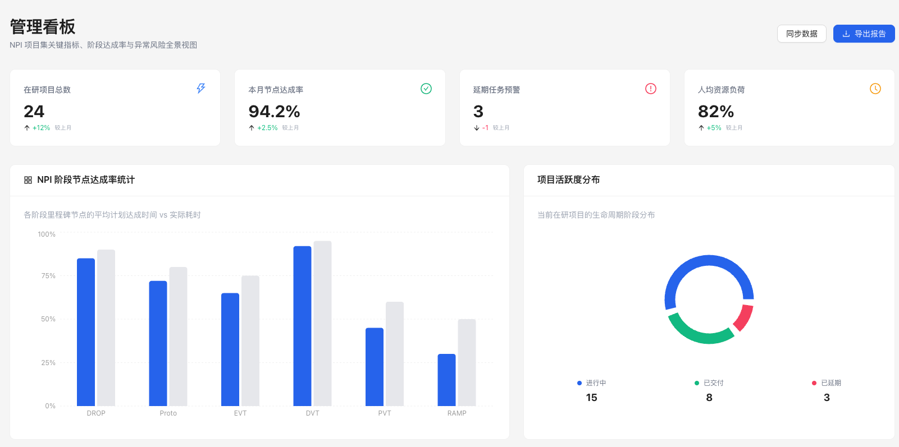

## Slide 17

3、项目解决方案

NPI表单技术实现路径梳理

- 近期，海克斯康+磁声双方针对NPI业务表单的技术路径进行评估。从结论上看，当NPI表单可通过“平台搭建+AI技术应用”的方案实现辅助编写，个别表单需通过AI训练方式分阶段实现。
- 注：AI应用场景的落地需以清晰的业务流程为基础，并依赖业务的线上化运行、及可获取的数据支撑

| 宁波磁声NPI业务表单和技术实现逻辑梳理-0227 |   |   |   |   |   |   |   |   |   |   |   |   |   |   |   |   |   |   |   |   |
| --- | --- | --- | --- | --- | --- | --- | --- | --- | --- | --- | --- | --- | --- | --- | --- | --- | --- | --- | --- | --- |
| NO. | 表单 | 优先级 | Apple Magsound | 表单形式 | 表单内容分析 | 业务逻辑梳理 | 关键需求提炼 | 业务数据准备要求 （磁声&海克斯康共同整理） | NPI协同平台 （李绪超、王鹏） |   |   |   | AI技术应用（李晓腾、程小峰） |   |   |   | 项目整体实现程度评估（%） | 项目资源投入 |   | 项目预估产出 （项目团队共同） |
|   |   |   |   |   |   |   |   |   | 技术路径 | 实现难易度 | 实现完整度估（%） | 实现难点 | 技术路径 | 实现难易度 | 实现完整度估（%） | 实现难点 |   | NPI协同平台 | AI技术应用 |   |
| 1 | Drawing Review
（DR） | 中 | Apple/Magsound | PPT | 1、PPT主要包括2部分，一部分是磁声工程师人员图纸存在问题的描述、另外一部分是问题的详细说明； 2、问题的概述，字段包括：序号、页码（ppt）、首件检验/SPC、问题的描述、图纸规格、建议的方案、PD部门的处理意见； 3、问题的详细描述，包括：① 尺寸项、对应图纸或检验报告的页码、问题描述、建议方案。② ppt中还会放2D图纸截图、提供历史的最优做法、写上建议方案； | 1、针对A客户提供的图纸（2D和3D），进行图纸标注的尺寸、产品性能要求的确认和评审； 2、如尺寸有问题或设计要求有问题时，将问题汇总、且提供正确的尺寸或图纸信息等，汇总提交给A客户； | 1. 针对A客户的图纸，识别图纸问题，并汇总； 2. 对识别的问题对历史相关问题做法进行查询，并生成修改提议，根据模板补全PPT，形成问题解决建议方案； | 1、评审问题的种类； 2、某些问题，如：尺寸、厚度等，形成设计标准、业务标准化； 3、历史的DR问题库：数据清晰； 4、DR报告模版固化：Y； | 1、在NPI研发协同平台中搭建DR评审子任务：PM启动DR后，评审人员收到评审任务，基于AI辅助填写评审意见、提供最佳案例建议； 2、PM整理评审意见，形成固定格式的DR报告； | 低 | 100% | 无 | 1、图纸识别：使用大模型对图纸进行描述，按照图纸问题识别逻辑进行图纸问题排查并输出； 2、Proposal生成：搭建历史DR数据知识库，根据历史DR经验自动检索并生成proposal； 3、PPT生成：固定模板和页面格式，根据识别的问题和Proposal生成PPT； | 中上 | 80% | 1. DR PPT： a. 图纸问题识别难度较高，需客户制作完整的图纸问题识别思维导图协助开发人员进行逻辑理解并实现算法开发； b. 数据需完整，相关数据关联逻辑需清晰，易查找 2. Proposal知识库：最优Proposal数据需全面，可大概率覆盖所有问题 | 60% | 1、人员： 双方成立项目组，磁声包括：业务关键用户、IT人员；海克斯康包括：业务顾问1人、 平台开发团队4-5人（产品经理1人、技术经理1人、开发工程师2-3人） 2、周期：7-8个月（业务调研&功能设计2个月，产品开发5-6个月） | 图纸识别AI应用 1、人员： 海克斯康算法人员1人：算法功能实现，数据整理和标注 磁声业务人员：业务流程梳理，数据整理和标注 2.、周期：24周 3.、成本：数据成本，硬件成本、工具和人员成本 | 1、搭建NPI研发协同平台，实现跨部门业务系统、NPI进度在线管控； 2、DR PPT：包含问题和问题对应的Proposal内容； 3、Proposal知识库：搜索增强，针对图纸问题能够给出更专业的搜索反馈。 |
| 2 | BOM （Bill of Material) | 中 | Magsound | Excel | 1、BOM List：【项目、阶段、系列、组件、组件客户图纸、组件3D、序号、零件客户图号】等项目信息来源于图纸，手动录入；【描述】和【预估良率】是业务人员自己根据经验录入； 2、研发BOM：【研发阶段、项目、序号】根据项目信息手工录入；【制程、工序】源于流程图规划，【零部件图号】源于内部规则，【治具名称、治具数量、设备名称、设备数量、工站、单线单板产能】业务人员基于经验手动录入； | 1、针对A客户提供的图纸（2D和3D），进行图纸拆解，明确每个产品所有须的物料、加工工序的确认和评审； | 按照业务表单模版生成表单； | 1、建立工序与治具（名称、数量）、设备（名称、数量）的匹配关系； 2、通过MES系统得出历史工序的产能数据、生产节拍数据； | 1、同上，在NPI研发协同平台中搭建编制BOM的任务，业务负责人在编制表单时，调用AI、使用AI技术辅助生成固定格式的表单； 2、如资料需审批，按照NPI业务流程执行任务审批； | 低 | 100% | 无 | 1. AI：图纸识别提取关键信息：【项目、阶段、系列、组件、组件客户图纸、组件3D、序号、零件客户图号】，并自动录入。 2. 针对内部规则开发自动化流程，自动录入【零部件图号】 3. AI：针对历史数据建立支持库或者微调本地模型，自动生成【描述、预估良率、治具名称、治具数量、设备名称、设备数量、工站、单线单板产能】等字段 | 中上 | 60% | 同上 | 60% | 同上 | 同上 | 1、搭建NPI研发协同平台，实现跨部门业务系统、NPI进度在线管控； 2、输出相关表单和历史经验知识库 |
| 3 | Process Flowchart | 中 | Magsound | PPT | 1、制程；2、工序； 注：表单现在是在BOM里面，后期可单独摘出来（目前表单内容见本表右侧截图） | 1、基于流程设计手动输入本项目的制程和工序内容； | 按照业务表单模版生成表单； | 1、标准产品的工序流程图库 | 1、方法1：根据关键字匹配制程，针对预设流程，自动化补全工艺流程 2、方法2：通过已有零件和流程图的匹配关系，提供初步的工艺流程图； | 低 | 100% | 特殊制程是否存在特殊工序 | / | / | / | / | 100% | 同上 | / | 1、搭建NPI研发协同平台，实现跨部门业务系统、NPI进度在线管控； 2、输出工艺流程表格 |

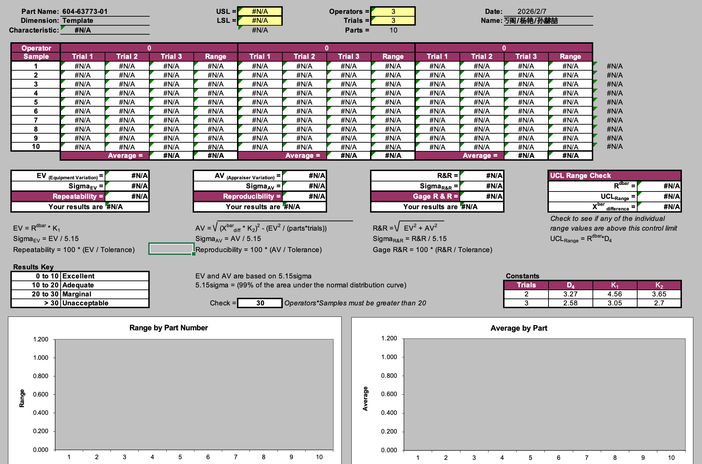

本表单是【系统搭建+AI应用】方案设计的基础，需成立项目组后双方深入研讨设计，形成更加详细、明确的解决方案和资源投入分析

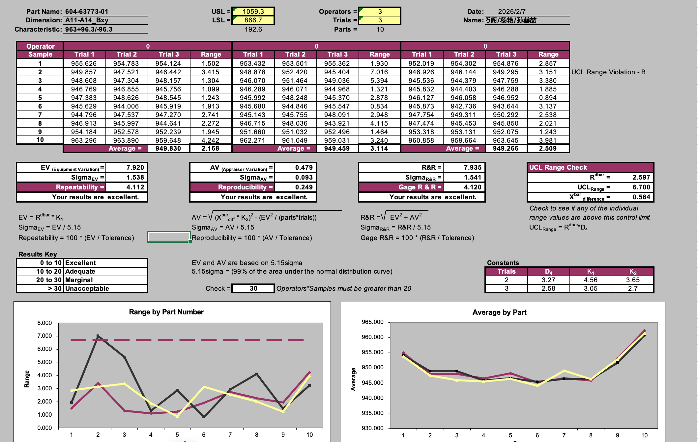

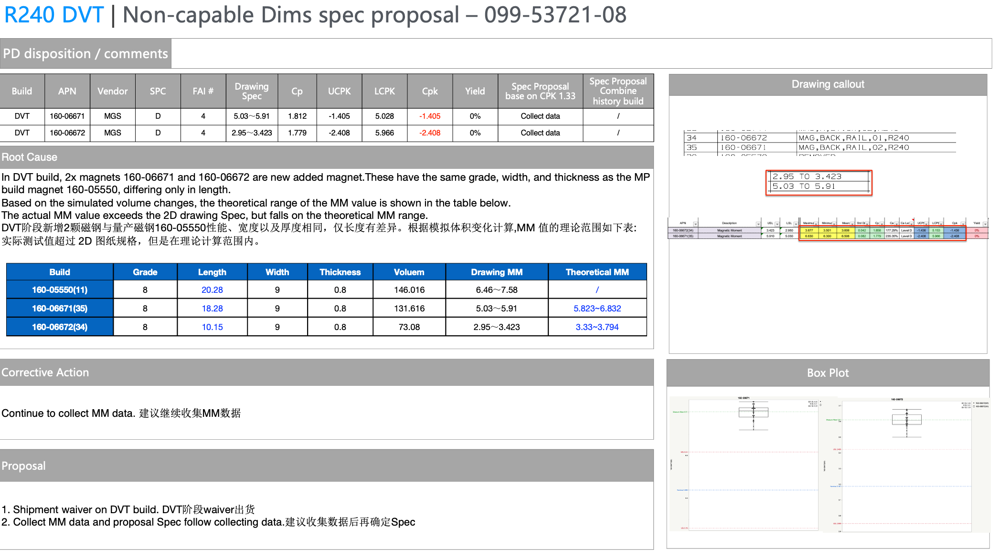

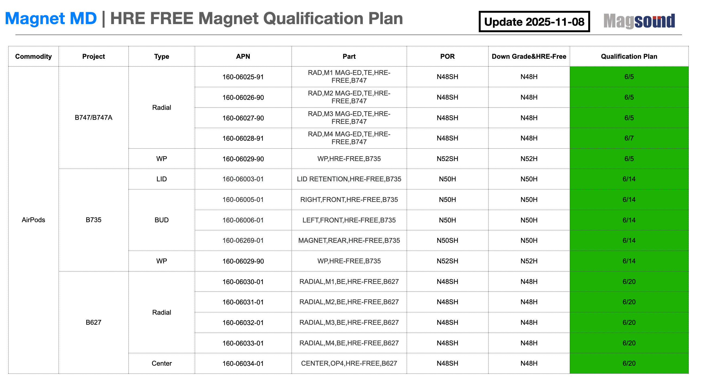

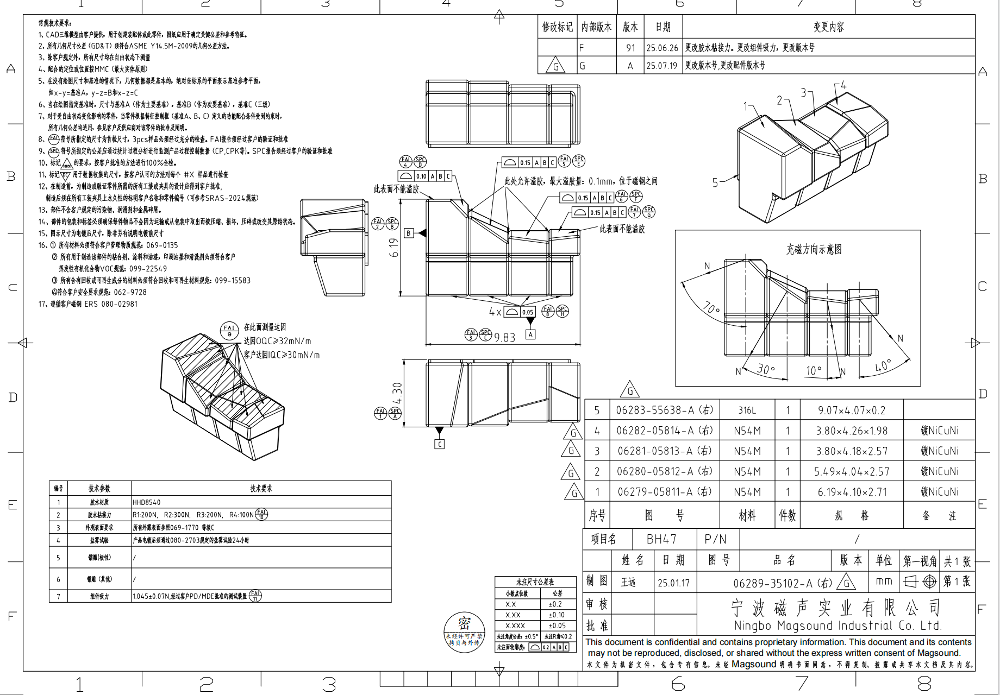

## Slide 18

3、项目解决方案

AI应用场景介绍：PDF图纸识别和评审

知识查询

内部工艺RAG知识库

LLM知识输出

- 子图
- 尺寸标注
- GD&T标注
- 箭头
- 支持线、引导线
- 圆、圆弧
- 标号（SPC，FAI）
- 文字类标注
- …

- 目的：识别图纸中的实体对应关系，生成如“标号-标注-几何特征”的结构化输出
- 算法：AABB碰撞盒检测；GNN边生成；自监督对比学习

实体关联分析

- 目的：检测出2D图纸中的每个子图，并检测出每个子图中的实体。
- 算法：Hough，RANSAC，目标检测，OCR

2D实体检测

2D图纸（PDF）

标注优化和风险提示

2D图纸自动生成

结构化2D图纸信息

2D标注正确性判断

- 目的：通过匹配算法关联2D图纸和3D几何特征
- 算法：模板匹配，余弦相似度匹配

2D&3D关联分析

目的：解析出3D数模中的几何和拓扑信息

3D模型解析

CMM待测特征列表

- 几何信息
- 拓扑信息

Hexagon ORCA

3D图纸（STL）

CMM测量程序

## Slide 19

四、项目实施方法

## Slide 20

4、项目实施方法

实施思路

本次项目采用“整体规划、分阶段实施”的实施路线，具体如下：

- 一、整体规划（周期2个月）
- NPI流程调研（细节待确认）
- 各业务表单研究（进行中，已识别一轮，待后续双方研讨细化）
- 规划整体方案：
- ① 基于NPI表单和业务需求，逐一进行各NPI表单实现路径的设计，输出：
- a、NPI研发协同平台功能规划方案；
- b、各NPI表单实现路径技术方案；

- 二、阶段一（周期6个月）
- 搭建NPI研发协同平台；
- 针对AI应用难易度低的表单，先进行试点验证，如：图纸识别、良率报告、YGA报告等；
- 磁声团队整理相关业务基础数据

阶段二： NPI平台功能迭代+AI应用高难度表单

平台迭代，AI应用攻坚

- 三、阶段二（周期5个月）
- 根据NPI研发协同平台应用情况，对平台功能进行迭代优化；
- 针对AI应用难易度高的表单，重点进行功能开发实现，如：BOM、DFM、外观检查标准等；

阶段一：NPI平台搭建+AI应用低难度表单

整体规划

平台搭建，AI应用试行

需求驱动、顶层设计

时间

## Slide 21

4、项目实施方法

实施开展计划：

| 磁声科技NPI阶段数字化应用 |   |   |   | 项目预期进度时间表 |   |   |   |   |   |   |   |   |   |   |   |   |
| --- | --- | --- | --- | --- | --- | --- | --- | --- | --- | --- | --- | --- | --- | --- | --- | --- |
| 阶段 | 任务名称 | 输出物 | 完成天 | 第1月 | 第2月 | 第3月 | 第4月 | 第5月 | 第6月 | 第7月 | 第8月 | 第9月 | 第10月 | 第11月 | 第12月 | 第13月 |
| 整体规划 | 1、NPI业务流程调研 | NPI流程 | T+5 |   |   |   |   |   |   |   |   |   |   |   |   |   |
|   | 2、各NPI业务表单实现路径研讨 | a、NPI研发协同平台搭建方案 | T+60 |   |   |   |   |   |   |   |   |   |   |   |   |   |
|   |   | b、各NPI表单实现路径技术方案
c、NPI表单实施阶段划分 | T+60 |   |   |   |   |   |   |   |   |   |   |   |   |   |
| 阶段一 | 3、NPI研发协同平台搭建（含功能开发、测试等） | NPI研发协同平台系统功能 | T+240 |   |   |   |   |   |   |   |   |   |   |   |   |   |
|   | 4、各AI应用场景功能开发（含功能开发、测试等） | AI应用能力
注：具体场景见下页 | T+120 |   |   |   |   |   |   |   |   |   |   |   |   |   |
| 阶段二 | 5、NPI研发协同平台迭代 | NPI研发协同平台系统功能 | T+330 |   |   |   |   |   |   |   |   |   |   |   |   |   |
|   | 6、各AI应用场景功能开发（含功能开发、测试等） | AI应用能力
注：具体场景见下页 | 待后期双方详细评估 |   |   |   |   |   |   |   |   |   |   |   |   |   |

项目实施计划

里程碑

- 蓝图
- 确认

- 系统
- 开发

## Slide 22

4、项目实施方法

NPI表单实施阶段划分（暂定）

针对在阶段二实现功能的NPI表单，阶段一时期需启动预研

| 编号 | 优先级 | NPI表单 | 实现完成度 | 实施阶段 | 备注 |
| --- | --- | --- | --- | --- | --- |
| 1 | 中 | Drawing Review （DR） | 80% | 阶段一 |   |
| 2 | 中 | BOM（Bill of Material) | 60% | 阶段二 |   |
| 3 | 中 | Process Flowchart | 100% | 阶段一 |   |
| 4 | 高 | Q-Plan | 70% | 阶段二 |   |
| 5 | 中 | CRR/GRR Template （重复性/相关性报告模版） | 90% | 阶段一 |   |
| 6 | 中 | CRR/GRR Report （重复性/相关性报告） | 90% | 阶段一 |   |
| 7 | 中 | Yield Report（良率报告） | 90% | 阶段一 | 初步评估，不需要AI技术 |
| 8 | 高 | FAI CPK Template / Report | 85% | 阶段一 |   |
| 9 | 高 | YGA (Yield Gap Analyze) | 90% | 阶段一 | 初步评估，不需要AI技术 |
| 10 | 中 | MIL (Major Issue List) | 90% | 阶段一 |   |
| 11 | 中 | Project Updates (PM/MDE/QPM) | 90% | 阶段一 | 初步评估，不需要AI技术 |
| 12 | 中 | Simulation (MM/FD/PC/Decay) | 100% | 阶段一 | 初步评估，不需要AI技术 |
| 13 | 低 | 内部图纸 | 难度高 | / | 实现难度高 |
| 14 | 中 | Packaging / Label | / | 待定 | 未看到表单，待定 |
| 15 | 中 | DFM（单件/组件） | 90% | 阶段一 |   |
| 16 | 中 | Station/Line Qual Plan & report（工位 & 产线 资格认证计划与认证报告） | / | 待定 | 未看到表单，待定 |
| 17 | 低 | CDML（组件数据管理清单） | 70% | 阶段二 |   |
| 18 | 中 | 外观检查标准 | 60% | 阶段二 |   |
| 19 | 中 | MTD (Measurement, Test Document) | 70% | 阶段二 |   |
| 20 | 中 | SIP（检验作业指导书） | 100% | 阶段一 |   |
| 21 | 低 | SOP（作业指导书） | 100% | 阶段一 |   |
| 22 | 中 | Reliability Test Report (可靠性报告） | 100% | 阶段一 | 初步评估，不需要AI技术 |
| 23 | 中 | OQC报告（出货检验报告） | 90% | 阶段一 |   |

### Speaker Notes

22

## Slide 23

4、项目实施方法

项目指导委员会

项目组织架构及职责

- 磁声科技
- 公司领导

- 海克斯康
- 公司领导

系统设计

系统开发

系统测试

业务梳理

功能开发

技术平台

甲方项目经理

乙方项目总监

- 乙方：架构师
- 甲方：业务部门关键用户、IT关键用户

- 乙方：开发工程师
- 甲方：IT关键用户

- 乙方：开发工程师
- 甲方：业务部门关键用户

- 乙方：业务顾问
- 甲方：业务部门关键用户

乙方：AI工程师

- 乙方：AI工程师
- 甲方：IT关键用户

主导项目整体规划，协调内部资源及重大问题决策。

总体把控项目质量、进度，协调甲方高层资源，审批重大技术方案。

甲方业务顾问

梳理NPI流程及功能需求、梳理NPI中的AI应用场景需求，参与项目蓝图设计及验收测试。

乙方项目经理

乙方技术经理

总体把控项目质量、进度，协调甲方业务资源，审批重大技术方案。

设计研发协同平台整体技术架构、及AI技术应用技术能力，制定AI实施方案。

AI应用子场景落地

研发协同平台搭建

## Slide 24

4、项目实施方法

项目风险管理机制

| 风险级别 | 应对方式 | 跟踪人 | 时间 |
| --- | --- | --- | --- |
| 高 | 1小时内响应，召开项目组专题会议，研讨解决方案，并在周报中体现跟踪过程 | 项目经理/项目对接人 | 1天内解决/执行有效措施 |
| 中 | 3小时内响应，酌情召开项目组专题会议，研讨解决方案，并在周报中体现跟踪过程 | 项目经理/项目对接人 | 3天内解决/执行有效措施 |
| 低 | 12小时内响应，执行人提出解决方案，并在周报中体现跟踪过程 | 项目经理 | 5天内解决/执行有效措施 |

偏差风险

已经识别的需求功能与预期效果偏差严重的风险

管理风险

项目过程中，人员变动、配合程度、响应速度等影响项目执行的风险

典型风险处理方案

- 1、申报项目管理委员会
- 2、提供风险纠偏解决方案或变更计划。双方会签审核

应对措施

- 1、风险逐级上报，由项目管理办公室评估严重等级
- 2、由项目管理委员会做出相应奖惩认定
- 3、项目管理办公室执行奖惩细节，通报双方项目组

## Slide 25

4、项目实施方法

项目沟通管理机制

项目执行过程汇报

- 月度汇报
- 为加强沟通，月度将与各方负责人汇报项目全貌，让其了解项目信息
- 如有问题或难处，项目经理在会上提出申请并请求各方责任人提供相关支持

- 里程碑
- 在项目关键节点或里程碑点完成将邀请负责人参与并作成果汇报

- 周汇报
- 项目经理每周以周报形式通过邮件向项目相关方进行汇报和同步
- 项目初始阶段采用双周报形式，中后期采用单周报形式

- 特殊情况
- 当项目出现项目变更、重大风险等问题时，可不定期召集相关干系人参与会议
- 成立项目内个业务小组，业务小组工作情况由双方小组长管控。汇报项目经理。

## Slide 26

4、项目实施方法

项目变更管理机制

| 变更范围 | 变更内容 | 响应措施 | 工期调整 | 备注 |
| --- | --- | --- | --- | --- |
| 极小 | 细节变更 | 经项目经理与开发团队评估后做出相应调整 | 不调整工期 | 例如字段增删改等 |
| 小 | 功能模块内局部变更 | 经项目经理与开发团队评估并汇报项目总监后做出相应调整 | 一般不调整工期 | 例如功能模块内局部调整 |
| 中 | 功能模块变更 | 经项目经理与开发团队评估并汇报项目总监后做出相应调整 | 评估新增工作量并调整工期 | 例如新增功能模块、修改功能逻辑 |
| 大 | 平台范围变更 | 上报项目指导委员会，得到批示后做出相应调整 | 重新核算工作量并修改工期 | 例如系统功能模块及逻辑大范围新增修改 |

## Slide 27

五、下一步重点工作

## Slide 28

5、下一步重点工作

项目风险及应对措施

| 序号 | 任务项 | 责任方 | 时间节点 | 备注 |
| --- | --- | --- | --- | --- |
| 1 | 推进商务工作，签订合作协议、备忘录等事宜 | 磁声、海克斯康 | 项目启动前 |   |
| 2 | 成立项目组，按照项目实施计划、实施思路推进项目开展：a、整体规划；b、系统搭建+AI应用场景应用 | 磁声、海克斯康 | / |   |

## Slide 29

_No extractable text content._
